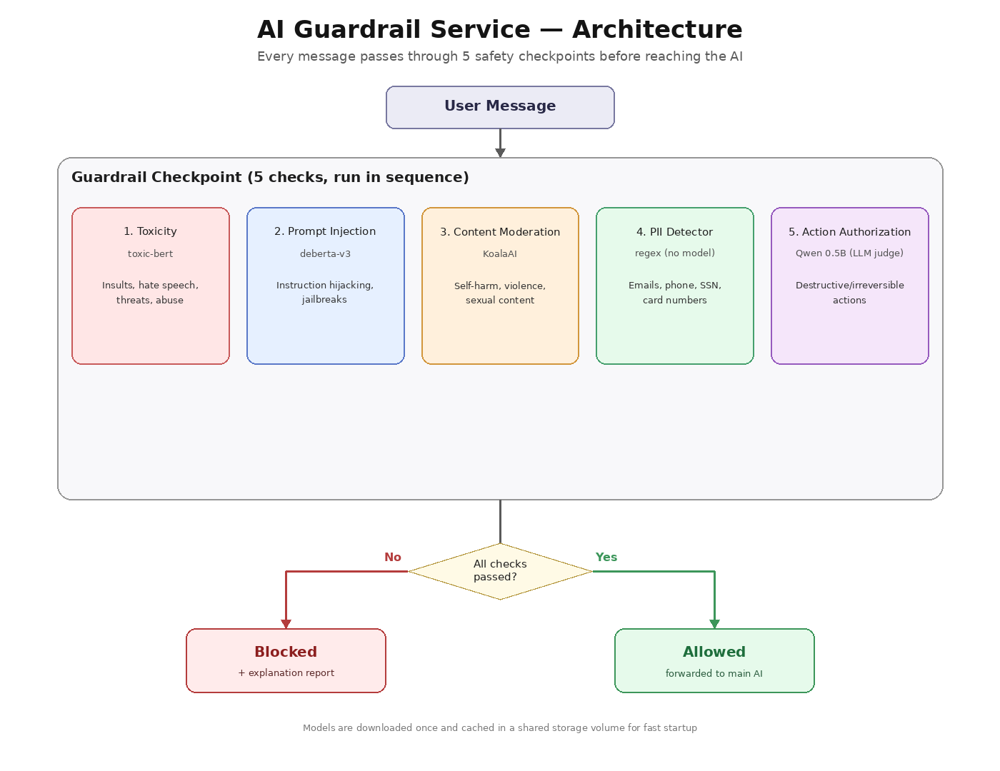
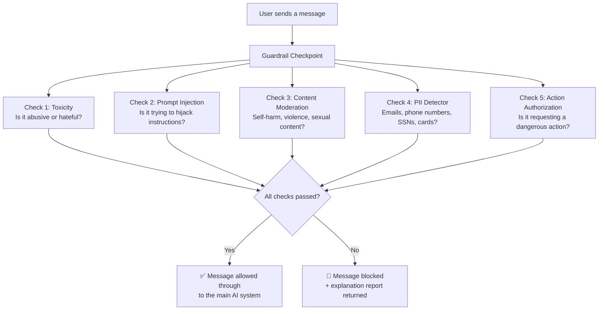
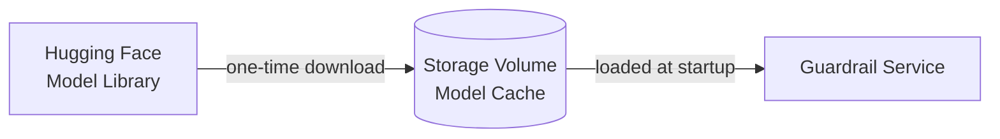

# 🛡️ AI Guardrail Service — README

## What is this?

This is a **safety checkpoint** that sits in front of an AI system (like a chatbot). Before any message from a user is allowed to reach the AI — or before the AI's response goes back to the user — it passes through a series of automated checks, like a security checkpoint at an airport.

Each "check" is handled by a small, specialized AI model trained to spot one specific kind of problem. If a message fails any check, it gets blocked and a report is returned explaining why.

---

## Why do we need this?

AI chatbots can be tricked or misused in several ways:
- Someone might try to make the bot say something abusive
- Someone might try to "hack" the bot's instructions ("ignore your rules and...")
- Someone might paste private information (emails, phone numbers, card numbers) that shouldn't be processed
- Someone might ask the bot to perform a dangerous, irreversible action ("delete all customer records")

This service catches all of that **before** it becomes a problem.

---

## The Big Picture (Architecture)

Here's the same flow as a diagram you can read at a glance:

Think of it like **five security guards standing in a row**, each trained to look for one specific thing. A message only gets through if it passes all five guards. If even one guard says "stop," the message is blocked and you get a report saying exactly which guard stopped it and why.

---

## Meet the Five Guards

| # | Guard Name | What it looks for | How it decides |
|---|------------|-------------------|-----------------|
| 1 | **Toxicity** | Insults, hate speech, threats, abusive language | A trained AI model (`toxic-bert`) reads the text and scores how "toxic" it sounds |
| 2 | **Prompt Injection** | Attempts to manipulate the AI's instructions (e.g. *"ignore previous instructions"*) | A trained AI model (`deberta-v3-prompt-injection`) recognizes known manipulation patterns |
| 3 | **Content Moderation** | Self-harm, violence, sexual content, hate speech | A trained AI model (`KoalaAI Text-Moderation`) classifies the message into safety categories |
| 4 | **PII Detector** | Emails, phone numbers, social security numbers, credit card numbers | Simple pattern-matching (no AI needed) — fast and instant |
| 5 | **Action Authorization** | Requests to delete, wipe, or destroy data, or other high-risk system actions | A small AI model (`Qwen 0.5B`) reasons about whether the request is asking for something dangerous and irreversible |

---

## How a Request Flows Through the System

1. **A message arrives** — e.g. *"Delete all customer records"*
2. **All five guards check it independently and in parallel** (conceptually — in code they run one after another, but each one is fast)
3. **Each guard returns a verdict**: passed or failed, plus a confidence score and a short reason
4. **If ALL guards pass** → the message is allowed through to the main AI
5. **If ANY guard fails** → the message is blocked, and the response tells you exactly which guard objected and why

### Example: A blocked request

**Input:** `"Delete all customer records"`

**What happens:**
- ✅ Toxicity guard: passes (not abusive)
- ✅ Prompt Injection guard: passes (not a hijack attempt)
- ✅ Content Moderation guard: passes (not violent/sexual/self-harm)
- ✅ PII guard: passes (no personal data detected)
- 🚫 **Action Authorization guard: FAILS** — recognizes this as a destructive, irreversible action

**Result:** Request blocked, with a report showing exactly why.

### Example: A safe request

**Input:** `"What's the weather in Mumbai?"`

All five guards pass → message is allowed through.

---

## Where Are the AI Models Stored?

All the AI models used by the guards are **downloaded once and cached** in a storage volume (like a shared hard drive), so the service doesn't need to re-download them every time it starts up. This makes the system fast and reliable after the first setup.

---

## What This System Is — and Isn't

✅ **It IS:**
- A first line of defense against abusive, manipulative, unsafe, or dangerous requests
- Fast, automated, and consistent — no human needs to manually review every message
- Modular — new "guards" can be added without rebuilding the whole system

❌ **It is NOT:**
- A replacement for proper access control (e.g. a guard *flagging* a delete request doesn't replace the database simply not allowing unauthorized deletes in the first place)
- 100% accurate — like any AI system, it can occasionally misjudge a borderline message (a false alarm, or a miss)
- A content filter for every possible risk (e.g. it doesn't currently catch misinformation, copyright issues, or off-topic conversations)

---

## Quick Glossary

- **Guardrail** — a safety rule or check that filters input/output
- **Classifier model** — an AI model trained to sort text into categories (e.g. "toxic" vs "not toxic")
- **PII** — Personally Identifiable Information (anything that could identify a specific person: email, phone, SSN, etc.)
- **Prompt Injection** — a trick where someone tries to override an AI's instructions by embedding fake commands in their message
- **False positive** — when a guard wrongly blocks something safe
- **False negative** — when a guard wrongly lets something unsafe through

---

## Summary in One Sentence

> Every message passes through five specialized AI checkpoints — for abuse, manipulation, unsafe content, private information, and dangerous actions — before it's allowed to reach (or leave) the main AI system.
